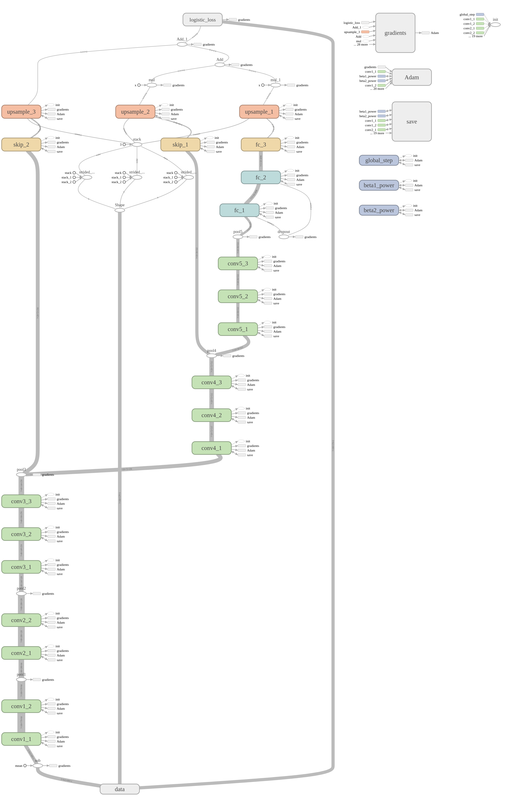

# Semantic Segmentation using a Fully Convolutional Neural Network

### Introduction
This repository contains a set of python scripts for you to train and test semantic segmentation using a fully convolutional neural network. Our semantic segmentation network is based on the [paper](https://people.eecs.berkeley.edu/~jonlong/long_shelhamer_fcn.pdf) described by Jonathan Long et al.

#### How to Train the Model
1. Since the network using VGG-16 weights, first, you have to download VGG-16 pre-trained weights from [https://www.cs.toronto.edu/~frossard/vgg16/vgg16_weights.npz](https://www.cs.toronto.edu/~frossard/vgg16/vgg16_weights.npz) and save in the the `pretrained_weights` folder.
2. Download [KITTI dataset](http://www.cvlibs.net/datasets/kitti/eval_road.php) and save it in the data\data_road folder.
3. Next, open a command window and type `python fcn.py` and hit the enter key.

Please note that training checkpointing will be saved to `checkpoints\kitti` folder and logs will be saved to `graphs\kitti` folder. So by using `tensorboard --logdir=graphs\kitti` command, you can start tensorboard to inspect the training process.

Following shows sample output we managed to obtain during testing time.

### Network Architecture

We implement the `FCN-8s` model described in the [paper](https://people.eecs.berkeley.edu/~jonlong/long_shelhamer_fcn.pdf) by Jonathan Long et al. Following figure shows the architecture of the network. We generated this figure using TensorBoard.

### The KITTI dataset

For training the semantic segmentation network, we used the [KITTI dataset](http://www.cvlibs.net/datasets/kitti/eval_road.php). The dataset consists of 289 training and 290 test images. It contains three different categories of road scenes:

* uu - urban unmarked (98/100)
* um - urban marked (95/96)
* umm - urban multiple marked lanes (96/94)

### Training the Model

When it comes to training any deep learning algorithm, selecting suitable hyper-parameters play a big role. For this project, we carefully select following hyper-parameters

|Parameter |Value  |Description|
|:---------|:------|:----------|
|Learning Rate|1e-5|We used `Adam` optimizer and normally 1e-3 or 1e-4 is the suggested learning rate. However, when we were experimenting with different learning rates we found out that 1e-5 works better than above values.|
|Number of epochs|25|The training dataset is not too big and it has only 289 training examples. Hence, we use a moderate number of epochs.|
|Batch Size|8|Based on the size of the training dataset, we selected batch size of 8 images.|

The following image shows how the training loss changes when we train the model.

### Conclusiotn

